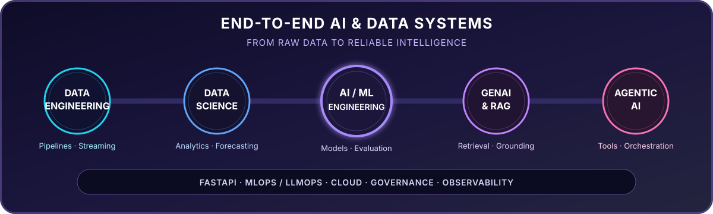

**Generative AI Engineer · Agentic AI Engineer · AI/ML Engineer · Data Scientist · Data Engineer**

I turn data into production intelligence—building the pipelines, models, retrieval systems, agents, APIs, and operational controls needed to ship dependable AI.

 

  

 

## Where I Add Value

<table>
<tr>
<td width="33%" valign="top">

### GenAI & Agents

- RAG and semantic search
- LangChain, LangGraph, LlamaIndex
- Tool calling, MCP, and routing
- Evaluation, guardrails, and HITL

</td>
<td width="34%" valign="top">

### AI/ML & Data Science

- Predictive modeling and forecasting
- NLP and computer vision
- Anomaly detection and recommendations
- Explainability with SHAP and LIME

</td>
<td width="33%" valign="top">

### Data & Production

- Batch and streaming pipelines
- Spark, Kafka, Airflow, and SQL
- FastAPI services and model serving
- Cloud, MLOps/LLMOps, and CI/CD

</td>
</tr>
</table>

---

## Selected Work

| Project | Engineering signal | Stack |
|---|---|---|
| [**Making AI Less Thirsty**](https://github.com/drona23/Personal_Project) | Forecasts data-center carbon and water impact, then routes AI workloads toward cleaner locations. | Python · XGBoost · Prophet · SHAP |
| [**LLM RAG Chatbot**](https://github.com/drona23/llm-rag-chatbot) | Builds grounded question answering with retrieval and automated response evaluation. | Python · RAG · LLM evaluation |
| [**Weather Data Pipeline**](https://github.com/drona23/weather-pipeline) | Runs hourly ETL for 28 U.S. cities with orchestration and relational storage. | Airflow · PostgreSQL · Python |
| [**Claude Token Efficient**](https://github.com/drona23/claude-token-efficient) | Benchmarks configuration strategies for efficient, reproducible agent workflows. | Python · Evaluation · Agents |

---

## Toolkit

**AI & Agents**

**Data & Application Engineering**

**Cloud & Delivery**

---

## How I Engineer

**Grounded over guessed** · **Evaluated over assumed** · **Observable over opaque** · **Production over prototype**

- Connect data engineering, modeling, retrieval, and application delivery as one system
- Measure model quality, retrieval relevance, hallucination risk, latency, cost, and drift
- Design for security, explainability, access control, auditability, and responsible AI

---

