 

**Generative AI Engineer · Agentic AI Engineer · AI/ML Engineer · Data Scientist · Data Engineer**

I build production ready AI and data systems from ingestion and modeling through retrieval, agents, APIs, evaluation, and observability.

---

## What I Build

<table>
<tr>
<td width="33%" valign="top">

### GenAI and Agents

- End to end RAG systems
- Semantic and hybrid retrieval
- LangChain, LangGraph, LlamaIndex
- Tool calling and MCP integrations
- Evaluation, guardrails, and HITL

</td>
<td width="34%" valign="top">

### AI/ML and Data Science

- Classification and regression
- Forecasting and anomaly detection
- Recommendations and segmentation
- NLP and computer vision
- Explainability with SHAP and LIME

</td>
<td width="33%" valign="top">

### Data and Production

- Batch and streaming pipelines
- Spark, Kafka, Airflow, and SQL
- FastAPI services and model serving
- Docker, Kubernetes, and cloud
- MLOps, LLMOps, CI/CD, and monitoring

</td>
</tr>
</table>

---

## Featured Builds

<table>
<tr>
<td width="50%" valign="top">

### [Making AI Less Thirsty](https://github.com/drona23/Personal_Project)

Predicts data center carbon and water impact, then routes AI workloads toward cleaner locations.

**Python · XGBoost · Prophet · SHAP**

</td>
<td width="50%" valign="top">

### [LLM RAG Chatbot](https://github.com/drona23/llm-rag-chatbot)

Delivers grounded question answering with retrieval and automated response evaluation.

**Python · RAG · LLM evaluation**

</td>
</tr>
<tr>
<td width="50%" valign="top">

### [Weather Data Pipeline](https://github.com/drona23/weather-pipeline)

Runs hourly ETL for 28 U.S. cities with orchestration and relational storage.

**Airflow · PostgreSQL · Python**

</td>
<td width="50%" valign="top">

### [Claude Token Efficient](https://github.com/drona23/claude-token-efficient)

Benchmarks configuration strategies for efficient and reproducible agent workflows.

**Python · Agents · Evaluation**

</td>
</tr>
</table>

---

## Engineering Principles

 

- Connect data engineering, modeling, retrieval, and application delivery as one system.
- Measure model quality, retrieval relevance, hallucination risk, latency, cost, and drift.
- Design for security, explainability, access control, auditability, and responsible AI.

<b>Explore the technical stack</b>

 

**AI, ML, and Agents**

**Data and Application Engineering**

**Cloud and Delivery**

 

**BUILD · EVALUATE · DEPLOY · OBSERVE**

